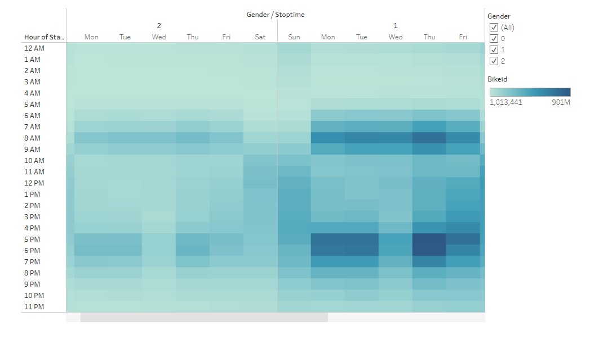

# NYC Citi Bike Sharing Analysis
## Purpose and Overview of Analysis

The purpose of the analysis is to visualize trends of New York City's Citi Bike usage to see how Citi Bike can be brought to other cities. 

- Categories to Explore:
  - Usage by Gender
  - Usage by Time: by Hour, Days of the Week
  - Trip Duration 
  - Customer Type 

- Resources:
  - NYC Citi Bike Trip Data from August 2019
  - Tableau, Python, Jupyter Notebook, Pandas Library
## Results
Seven Analyses were made from the data provided. You can [view the full story in Tableau](https://public.tableau.com/views/NYCCitiBikeVisualization_16490350717130/NYCCitiBikeVisualization?:language=en-US&publish=yes&:display_count=n&:origin=viz_share_link).
  - Looking at the data from **Top Starting Locations** and **Top Ending Locations**, we can see which places are most popular and high trafficked areas. What makes areas more frequented than others? How can we get more users at less frequented areas?
  -  -
  -  - A quick view of the **Gender Breakdown** shows that men are roughly three times more likely than women to Citi Bike. Women make up approximately 25% of Citi Bike users. Futher examination is required to understand why the gender difference is so large.
  -  - Looking at **Checkout Time for Users** and **Checkout Times by Gender**, we can see that the checkout time high is 5 minutes. Since men are the majority of users, their checkout time amount is significantly higher then women and those with no known gender. 
  -  - The heat map of **Trips by Weekday** shows Saturday and Sunday have high usage from 9AM to 5PM, while Monday to Friday shows peak usage from 6AM to 9AM and 4PM to 7PM. This lines up with a 9-5 work week and weekends off. 
  -  - Spliting the Trips by Weekday heat map by gender gives us **Trips by Gender (Weekday per Hour)**. The times are roughly the same for, but with men having a higher density of trips. This heat map also shows the highest male usage time to be Thursdays from 5PM to 6PM. What about Thursdays significantly increases the number of users?
  - - Looking at **User Trips by Gender by Weekday** we see the differences between Citi Bike Subscribers and Customers and then split that into gender. Male Subscribers are the highest amount of users. Male Subscribers ride the most on Thursdays. 
  -  - With all this bike riding and sharing, surely bikes need to be repaired. **Bike Repairs** shows us the number of repairs per bike and **Bike Utilization** shows us how long each bike is used for. 

## Summary: 
Provide a high-level summary of the results and two additional visualizations that you would perform with the given dataset.
